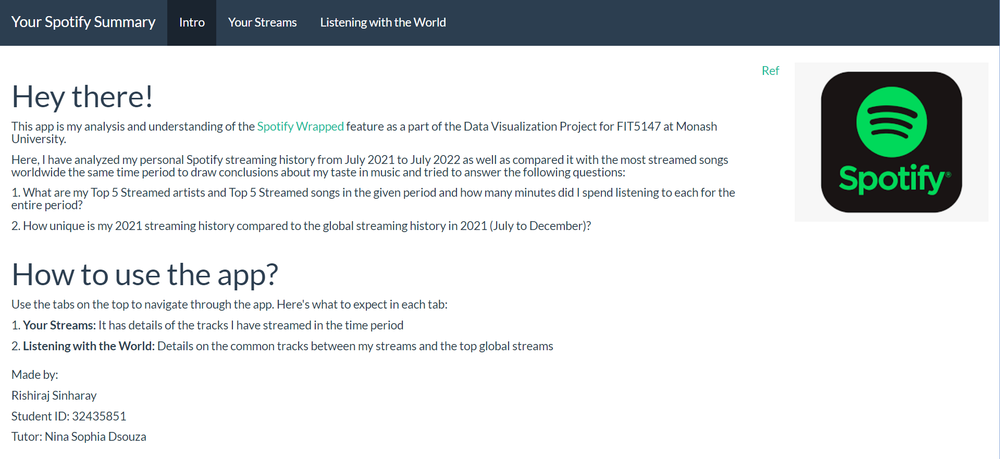

# Analysis of My Personal Spotify Dataset

## Description
This project is a deep dive into personal Spotify streaming data from July 2021 to July 2022, inspired by Spotify's marketing campaign, Spotify Wrapped. The project focuses on visualizing streaming habits, comparing them with global trends, and answering specific questions about top artists and tracks over the year. This project was carried out on R Shiny.

- Install all required packages/libraries as specified on the top of the ui.R and server.R files by removing the comment sign.
- Load all the packages/libraries as specified on the top of the ui.R and server.R files.

## About the Files
- Personal Spotify Data: Contains streaming history from the user for the period July 2021 to July 2022.
- Global Spotify Data: Includes data on the most streamed songs globally during the same period to facilitate comparison.
- Analysis Scripts: R scripts used for data wrangling, analysis, and visualization (server.r and ui.r)
- Visualizations: Outputs in the form of interactive plots and charts that allow detailed exploration of streaming habits.

## Author
This project was carried out by Rishiraj Sinharay, under the supervision of tutor Nina Sophia Dsouza as a part of the Data Exploration and Visualization unit at Monash University.
